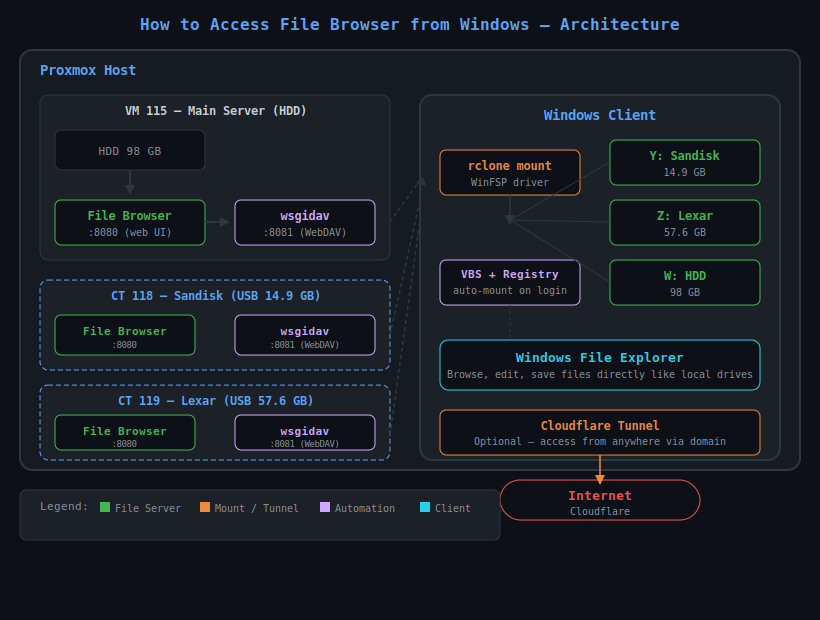

[](LICENSE)
[](#)

# How to Access File Browser from Windows Explorer

Access your File Browser storage as a mapped drive in Windows — browse, edit, and save files directly from File Explorer.



## Why?

File Browser gives you a web interface to manage files on your server. But sometimes you want to:

- Open and save files directly from Windows apps (Word, Excel, Photoshop)
- Drag-and-drop multiple files at once
- Use Windows Explorer's search, sort, and preview features
- Access files faster without opening a browser

This guide adds WebDAV support alongside your existing File Browser so you can do all of the above.

## Architecture

```
┌──────────────────────┐      ┌───────────────────────┐
│  Linux Server        │      │  Windows Client        │
│                      │      │                        │
│  File Browser :8080  │      │  rclone + WinFSP       │
│  (web UI)            │      │  Y:, Z:, W: drive      │
│                      │ HTTP │                        │
│  wsgidav :8081       │◄────►│  File Explorer          │
│  (WebDAV)            │      │                        │
│                      │      │  Auto-mount on login   │
│  └─ serves same      │      │                        │
│     files as File    │      │                        │
│     Browser          │      │                        │
└──────────────────────┘      └───────────────────────┘
```

## Requirements

- **Windows 10/11** with admin access (one-time only)
- A server already running **File Browser** (optional — works with any WebDAV source)

## Step 1: Install WinFSP (one-time)

rclone needs WinFSP to create virtual drives in Windows.

1. Download WinFSP from [winfsp.dev/rel/](https://winfsp.dev/rel/)
2. Run the installer (admin required)
3. Reboot when prompted

## Step 2: Set Up WebDAV on Your Server

If your server doesn't have WebDAV yet, install wsgidav:

```bash
# On your Linux server
python3 -m venv /opt/wsgidav-venv
source /opt/wsgidav-venv/bin/activate
pip install wsgidav cheroot lxml

# Run (replace /path/to/files with your actual directory)
wsgidav --host=0.0.0.0 --port=8081 --root=/path/to/files --auth=anonymous
```

**For persistent service (systemd):**

```bash
cat > /etc/systemd/system/wsgidav.service << 'EOF'
[Unit]
Description=WsgiDAV WebDAV Server
After=network.target

[Service]
Type=simple
ExecStart=/opt/wsgidav-venv/bin/wsgidav --host=0.0.0.0 --port=8081 --root=/path/to/files --auth=anonymous
Restart=always
RestartSec=5
User=root

[Install]
WantedBy=multi-user.target
EOF

systemctl daemon-reload
systemctl enable --now wsgidav.service
```

> Make sure `--root` points to the same directory your File Browser serves.

## Step 3: Configure rclone on Windows

```batch
rclone config create myfilebrowser webdav url http://YOUR_SERVER_IP:8081/ vendor other
```

Replace `YOUR_SERVER_IP` with the actual IP or hostname of your server.

## Step 4: Mount as a Drive

Run this in Command Prompt or PowerShell (non-admin is fine):

```batch
rclone mount myfilebrowser: X: --vfs-cache-mode=full
```

- `X:` = any free drive letter you want
- Keep the terminal window open while using the drive
- Press `Ctrl+C` to unmount

## Step 5: Auto-Mount on Login

Create a VBS script so the drive mounts automatically when you log in.

**`C:\Users\yourname\scripts\mount-webdav.vbs`:**

```vbs
CreateObject("WScript.Shell").Run "rclone mount myfilebrowser: X: --vfs-cache-mode=full", 0, False
```

Add it to startup via Registry:

```batch
reg add "HKCU\Software\Microsoft\Windows\CurrentVersion\Run" /v "MountFileBrowser" /t REG_SZ /d "wscript.exe C:\Users\yourname\scripts\mount-webdav.vbs" /f
```

No admin needed — it runs on your user login.

## Exclude Unnecessary Files (Optional)

Skip Windows system folders that appear on exFAT drives:

```batch
rclone mount myfilebrowser: X: --vfs-cache-mode=full --exclude "System Volume Information/**"
```

## Multiple Drives

If you have multiple storage locations (e.g. USB drives), add multiple remotes and mount each to a different drive letter:

```batch
rclone config create storage1 webdav url http://SERVER_IP_1:8081/ vendor other
rclone config create storage2 webdav url http://SERVER_IP_2:8081/ vendor other

rclone mount storage1: Y: --vfs-cache-mode=full
rclone mount storage2: Z: --vfs-cache-mode=full
```

## Quick Reference

| Action | Command |
|--------|---------|
| Mount drive | `rclone mount myremote: X: --vfs-cache-mode=full` |
| Unmount | `Ctrl+C` or close terminal |
| List remotes | `rclone listremotes` |
| Test connection | `rclone lsd myremote:` |
| Check drive usage | `rclone about myremote:` |

## Troubleshooting

- **"daemon mode is not supported"**: Remove `--daemon` flag. Windows doesn't support it — use VBS script instead for background mount.
- **"mountpoint path already exists"**: Close previous rclone process first, or change drive letter.
- **"WinFSP not found"**: Reboot after installing WinFSP, or reinstall.
- **Drive shows 1.00 PB**: WebDAV server is unreachable — check server IP, port, and firewall.
- **Folder "System Volume Information" appears**: Add `--exclude "System Volume Information/**"` to your mount command.
- **File Browser web UI is on port 8080, WebDAV on 8081**: Yes, they run side by side. File Browser stays available via browser at port 8080.

## Related

- [How to Turn Your Flashdisk Into Cloud Storage](https://github.com/MrElixir67/how-to-turn-your-flashdisk-into-cloudstorage) — Server-side setup using File Browser + Cloudflare Tunnel
